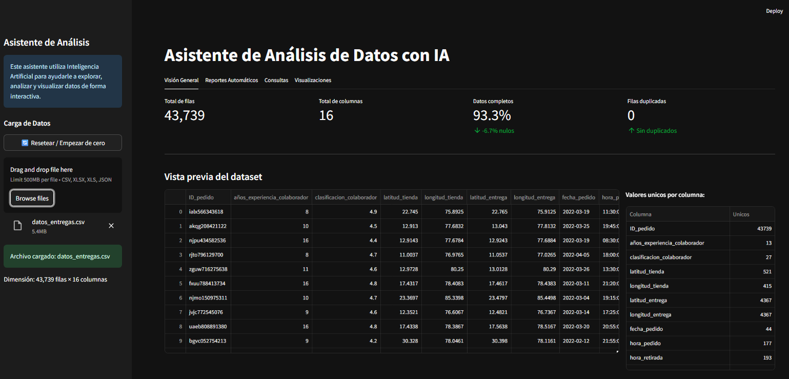
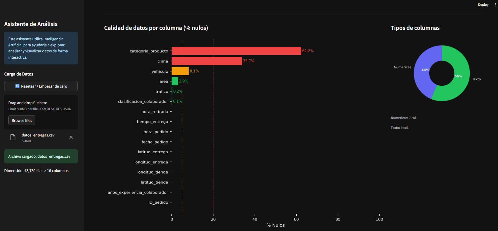
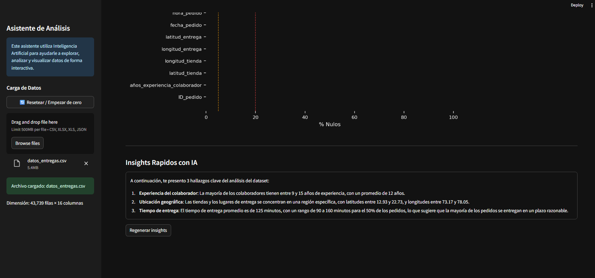
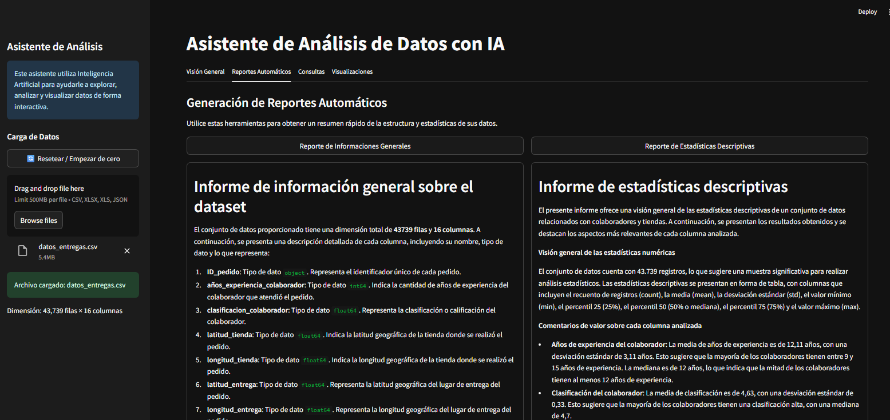
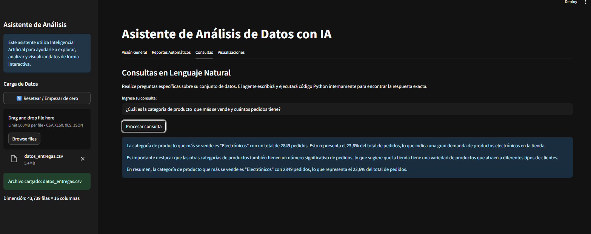
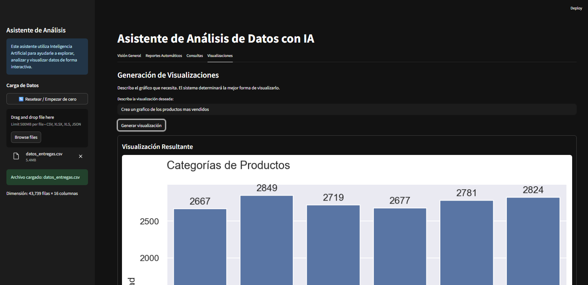

# 🤖 Asistente de Análisis de Datos — Demo

Código de demostración: una interfaz de análisis de datos construida con Streamlit que facilita la exploración rápida de datasets (CSV, Excel, JSON) y la generación de insights.

Breve descripción:
- Interfaz con previsualización del `DataFrame`, KPIs y gráficos de calidad de datos.
- Herramientas para resumen estadístico, gráficos y ejecución segura de pequeñas consultas en Python sobre los datos.

Tecnologías principales: Python 3.11, Streamlit, Pandas, Matplotlib, Seaborn.

## Ejemplo (capturas)
Incluye varias capturas en `imagenes/` que muestran la carga de datos, KPIs, insights y visualizaciones.

## Capturas de pantalla

Las siguientes imágenes muestran la interfaz y las funcionalidades principales en el mismo orden en que se navega la aplicación.

### 1) Carga y configuración / Vista previa y KPIs

Pantalla inicial con el panel lateral donde se cargan los archivos (CSV, Excel, JSON), botón para resetear la sesión y pequeñas indicaciones de uso.
Previsualización de las primeras filas del `DataFrame` y tarjetas KPI que muestran total de filas, columnas, porcentaje de datos completos y duplicados.

### 2) Calidad de datos (% nulos)

Gráfico horizontal que presenta el porcentaje de valores nulos por columna, con líneas de referencia para alertar (5% y 20%).
Gráfico tipo donut que resume la proporción de columnas numéricas, de texto y de fecha.

### 3) Insights automáticos con IA

Sección que muestra los 3 hallazgos automáticos generados por el modelo, pensados para ser breves y accionables.

### 4) Reportes automáticos

Herramientas para generar resúmenes de información general y estadísticas descriptivas; posibilidad de descargar los reportes en PDF.

### 5) Consultas y visualizaciones

Panel para hacer consultas en lenguaje natural.


El agente puede ejecutar código Python internamente y generar visualizaciones que se renderizan en la interfaz.

## Cómo descargar y ejecutar localmente (resumen rápido)

1) Clona el repositorio y crea un entorno virtual:

```powershell
git clone https://github.com/juaquinedca/Copiloto-de-an-lisis-de-ficheros-con-IA.git
cd Copiloto-de-an-lisis-de-ficheros-con-IA
python -m venv .venv
.\.venv\Scripts\Activate.ps1   # Windows PowerShell
```

2) Instala dependencias y (opcional) crea `.env`:

```powershell
python -m pip install --upgrade pip
pip install -r requirements.txt
echo GROQ_API_KEY=tu_clave_aqui > .env    # opcional: para funcionalidades LLM
```

3) Ejecuta la demo:

```powershell
streamlit run app.py
```

Alternativa de doble click (Windows): usa `Iniciar_Programa.bat` — el script crea/activa `.venv` e instala dependencias si no existen.

Notas rápidas:
- No subas tu `.env` al repositorio.
- El proyecto se publica como demo del código; no hay un ejecutable (.exe) oficial en este repositorio.
- Si quieres desplegar públicamente, considera Streamlit Cloud o un servidor con Python 3.11.

Si necesitas que deje algún archivo de ejemplo (por ejemplo un CSV de prueba) en la carpeta `data/`, dímelo y lo añado.

