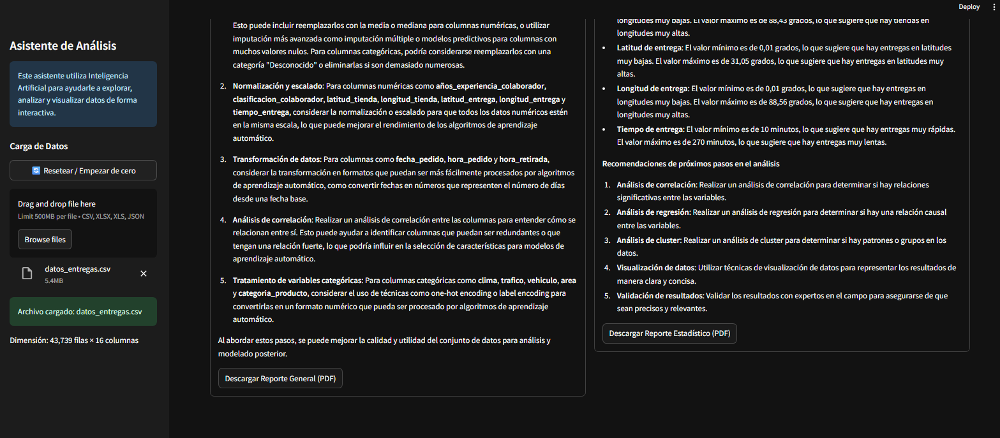

# 🤖 Asistente de Análisis de Datos con IA

Aplicación web interactiva construida con Streamlit que permite analizar datasets (CSV, Excel, JSON) usando agentes basados en LangChain + Groq.

## Características
- Dashboard automático: KPIs, % nulos, tipos de columnas.
- Insights generados con IA.
- Consultas en lenguaje natural que ejecutan código Python sobre el DataFrame.
- Visualizaciones dinámicas y exportación de reportes en PDF.

## Tecnologías
- Python 3.11
- Streamlit, Pandas, Matplotlib, Seaborn
- LangChain + Groq (requiere GROQ_API_KEY)

## Instalación (local)
`powershell
python -m venv .venv
.\.venv\Scripts\Activate.ps1
pip install -r requirements.txt
`

Configura tu clave de Groq en un archivo .env en la raíz:
`
GROQ_API_KEY=tu_clave_aqui
`

Ejecuta la aplicación:
```powershell
streamlit run app.py
```

## Capturas de pantalla

Las siguientes imágenes muestran la interfaz y las funcionalidades principales en el mismo orden en que se navega la aplicación.

### 1) Carga y configuración

Pantalla inicial con el panel lateral donde se cargan los archivos (CSV, Excel, JSON), botón para resetear la sesión y pequeñas indicaciones de uso.

### 2) Vista previa y KPIs

Previsualización de las primeras filas del `DataFrame` y tarjetas KPI que muestran total de filas, columnas, porcentaje de datos completos y duplicados.

### 3) Calidad de datos (% nulos)

Gráfico horizontal que presenta el porcentaje de valores nulos por columna, con líneas de referencia para alertar (5% y 20%).

### 4) Tipos de columnas

Gráfico tipo donut que resume la proporción de columnas numéricas, de texto y de fecha.

### 5) Insights automáticos con IA

Sección que muestra los 3 hallazgos automáticos generados por el modelo, pensados para ser breves y accionables.

### 6) Reportes automáticos

Herramientas para generar resúmenes de información general y estadísticas descriptivas; posibilidad de descargar los reportes en PDF.

### 7) Consultas y visualizaciones

Panel para hacer consultas en lenguaje natural; el agente puede ejecutar código Python internamente y generar visualizaciones que se renderizan en la interfaz.

Si quieres que cambie el texto de alguna imagen (por ejemplo añadir más detalle técnico o resaltar otra funcionalidad), dime cuál y lo actualizo.
